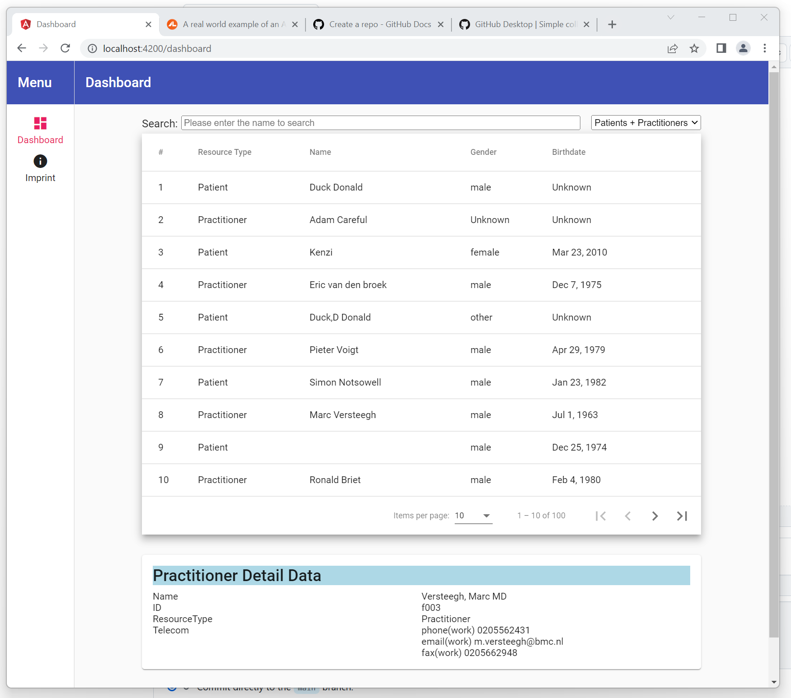
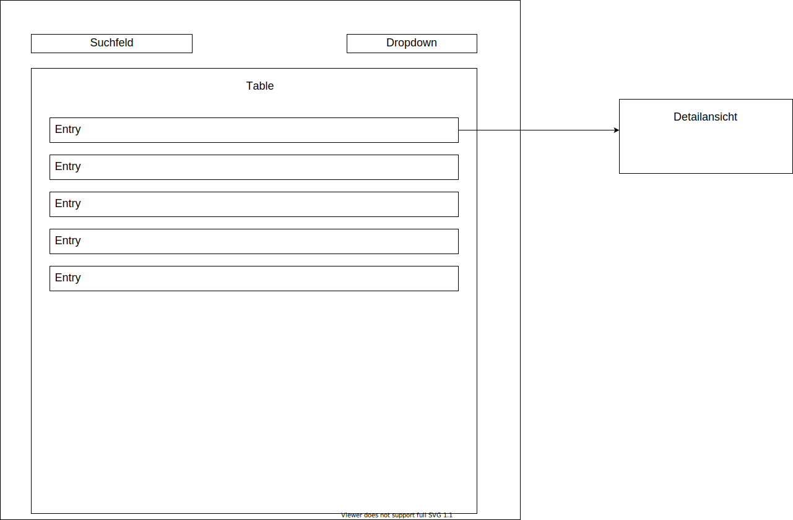

# UnicornMedical

## Anmerkung zur Lösung:
Da die Implementierung der Detailansicht mir überlassen ist und ich es aus der Benutzerperspektive als sinnvoll erachte habe ich die Detailansicht als Komponente in das Dashboard gepackt.
Somit hat der Anwender nicht ein nerviger Dialog den er wegklicken muss gerade wenn er eine Person sucht aber es gibt diese mehrfach "Hans Müller". So ist er schnell in der Lage die 
Datensätze durchzuklicken.

Die Komponenten search_form und detailView sind simple Präsentation Components oder PURE Components, sie haben keinen Zugriff auf den searchService nur auf die notwendigen models (interfaces). 
Prinzipiell hätte man das falls die Zeit da wäre auch durch eigene models noch abstrahieren/entkoppeln können dann wären die Komponenten universal wiederverwendbar.
Ausschließlich die dashboard Komponente (Smart Component) nutzt den searchService und besitzt die Logik. Die Kommunikation zwischen den Komponenten erfolgt ausschließlich über Observables.
Es wäre also möglich die ChangeDetectionStrategy im @Component Decorator auf push zu stellen und die Performance so etwas zu erhöhen.
Die Search Funktionalität des Dashboards habe ich etwas refactored um redundanten code zu vermeiden. Es erfolgt nun über eine eigene Methode und wird nicht beim Deklarieren der Observables ausgeführt. 

### 4 Optionale Zusatzaufgabe: Erstellen von Unittests mit Jest für die SearchFacadeService
Da Unit Tests Repeatable sein sollen: Also auf unveränderlichen, immer gleichen Daten beruhen sollten, was bei der Demo API evtl. nicht dauerhaft zu gewährleisten ist, werden diese Daten über Mock Implementationen des PatientSearchService und PractitionerSearchService bereitgestellt. Somit lässt sich SearchFacadeService die SearchFacadeService unabhängig von der API testen.
Es wäre auch möglich gewesen über jest Mock Methoden und Objekte den gemockten Test zu realisieren und nicht über implementierte Mock Klassen. 
Dieser Ansatz hat jedoch mehr Flexibilität, die Applikation kann theoretisch ohne fertiger/funktionsfähiger API entwickelt werden, Backend und Frontend Team können ein Stück weit parallel entwickeln.

## Überblick über die Testaufgabe

### Einführung

Für die Testaufgabe soll eine kleine Anwendung implementiert werden, um Patienten und Ärzte zu suchen und diese darzustellen.
Als Grundlagen für die Testdaten wird eine offene FHIR REST Schnittstelle verwendet.
FHIR ist ein internationaler Standard für den Austausch von Medizindaten (siehe weiterführende Links).
Die Patienten und Ärzte sollten über eine Freitextsuche anhand ihres Namens gefunden werden. Die Ergebnisse sollen über einen Filter weiter
eingeschränkt werden können (Patient/Ärzte, nur Ärzte, nur Patienten).
Beim Klick auf einen Eintrag im Table soll sich eine kleine Detailansicht öffnen, die weitere Daten zu dem jeweiligen Eintrag darstellt.

Der Table, Routing und die entsprechenden FHIR REST Services sind bereits implementiert.

Die Aufgabe besteht im Wesentlichen aus folgenden Teilen:

1. Fehlersuche
2. Erstelle eine Suchform
3. Detailansichten
4. Optionale Zusatzaufgabe: Erstellen von Unittests mit Jest für die SearchFacadeService

### 1. Fehlersuche

Zu Beginn der Aufgabe wird ein Fehler zu lösen sein, es gilt diesen ausfindig zu machen und eine Lösung zu implementieren.
Bei der Abgabe bitte kurz erklären, warum dieser Fehler aufgetreten ist.
Es reicht an der entsprechenden Stelle kurz einen Kommentar zu verfassen.

### 2. Erstelle eine Suchform

Erstelle ein Formular mit einem Input für eine Freitextsuche und einem Dropdown für einen Filter.
Auf dem Inputfeld soll eine Validation stattfinden. Falls das Formular invalide ist, soll keine neue Suchanfrage abgeschickt werden.
Bei der Suchform sollten Reactive Forms verwendet werden.

Unter "ui/search-form" wurde hierfür bereits eine Komponente angelegt.

Für die Validation des Suchfelds gelten folgende Regeln:

1. Es sind alle Buchstaben erlaubt (außer Umlaute `ä ü ö`)
2. Es sind alle Zahlen erlaubt
3. Es sind keine Whitespaces erlaubt

Anmerkung: ein leerer String ist erlaubt

Über einen Dropdown soll der User die Ergebnisse auf Basis ihres FHIR Profiles weiter einschränken können.
Folgende Filtermöglichkeiten sollen implementiert werden:

1. Patients + Practitioners (Patient/Ärzte)
2. Patients (Patient)
3. Practitioners (Ärzte)

### 3. Detailansichten

Beim Klick auf einen Eintrag im Table soll sich eine detaillierte Ansicht für die jeweilige Entität öffnen.
Wie genau die Detailansicht implementiert wird, ist dir überlassen.

Folgende Daten sollten mindestens angezeigt werden:

1. Für den Patienten
   1. Resource Typ
   2. Name
   3. ID
   4. Geburtstag
   5. Gender
   6. Adresse
2. Für den Arzt (Practitioner)
   1. Resource Type
   2. Name
   3. ID
   4. Telecom

Unter "src/app/search/services/fhir.util.service.ts" findest du eine Methode, um die FHIR Daten für die Detailansicht
aufzubereiten.

### 4 Optionale Zusatzaufgabe: Erstellen von Unittests mit Jest für die SearchFacadeService

Die bereits angelegt Unittests für den SearchFacadeService sollten noch befüllt werden.
Siehe: src/app/search/services/search-facade.service.spec.ts

### Weiterführende Links

- Warum Fhir? <https://hl7.de/themen/hl7-fhir-mobile-kommunikation-und-mehr/warum-fhir/>
- Dokumentation Patient: <http://www.hl7.org/fhir/patient.html>
- Dokumentation Practitioner: <https://www.hl7.org/fhir/practitioner.html>

## Start der Applikation

Mit dem Befehl `ng serve` startet die Applikation auf folgender URL: `http://localhost:4200/`.
